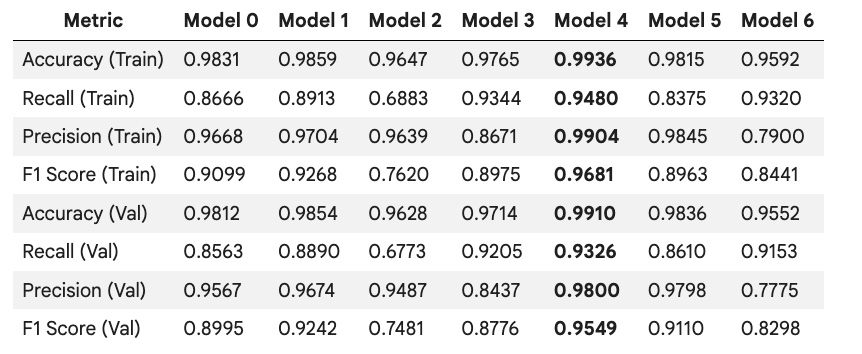

# 🎯GeneratorFailure
Predictor generator failures so that generators are repaired before failing/breaking. Reduce the overall maintenance cost.

## 🧩Project Overview
This notebook details the process of building and evaluating machine learning models to predict generator failures in wind turbines. The objective is to help "ReneWind" minimize maintenance costs by enabling predictive maintenance.

## 🚨Problem Statement
Renewable energy, particularly wind energy, requires efficient operation and maintenance. Predictive maintenance, using sensor data to anticipate component degradation, can significantly reduce costs. This project aims to predict wind turbine generator failures to facilitate timely repairs and avoid costly replacements.

## 🧠 Business Context
"ReneWind" has provided a ciphered dataset containing 40 predictor variables and a target variable indicating generator failure (1) or no failure (0). The cost implications are crucial:

True Positives (TP): Correctly predicted failures (repair costs).
False Negatives (FN): Undetected real failures (replacement costs, which are higher than repair costs).
False Positives (FP): Predicted failures that do not occur (inspection costs, lower than repair costs). The primary goal is to maximize the detection of true failures (high recall) to minimize replacement costs.
Objective
To develop, tune, and select the best classification model that accurately predicts wind turbine generator failures, focusing on maximizing recall for the 'failure' class.

## 📘 Data Description
Train.csv: Used for model training and tuning (20,000 observations).

Test.csv: Used for final model performance evaluation (5,000 observations).

Both datasets contain 40 numerical predictor variables (V1-V40) and 1 target variable (Target).

**Data Overview and Preprocessing**
**Shape:** Training data: (20000, 41); Test data: (5000, 41).

**Data Types:** All predictor variables are float64, and the Target variable was converted to float64 for consistency.

**Duplicate Values:** No duplicate values found in the training data.

**Missing Values:** Small percentages of missing values were found in V1 and V2 for both train and test sets (around 0.09% - 0.12%). These were imputed using the median strategy to prevent data leakage during model training.

**Statistical Summary:** Variables range between approximately -25 and 25. Outliers were observed but were considered inherent to the data rather than errors.

**Target Variable Distribution:** The target variable is imbalanced, with approximately 5.5% representing 'failure' (1) and 94.5% representing 'no failure' (0) in both training and test sets.

**Correlation Check:** Variables V23 to V33 showed higher correlation among themselves.

**⚙️ Model Building and Evaluation**
Several neural network models were built and evaluated based on Recall, as minimizing false negatives (undetected failures) is critical due to higher replacement costs.

## 📊 Models Developed
**0. Model 0 (Initial Model):** A simple neural network with one hidden layer (7 neurons) and ReLU activation, using SGD optimizer. Achieved a validation recall of ~0.72 for the failure class.

**1. Model 1:** Added another hidden layer (14 and 7 neurons) with ReLU activation, using SGD optimizer. Improved validation recall to ~0.78 for the failure class, but showed signs of overfitting.

**2. Model 2:** Introduced a Dropout layer (0.5) after the first hidden layer in Model 1 architecture to mitigate overfitting, using SGD. This model significantly reduced recall, suggesting that regularization with a high dropout rate was not beneficial.

**3. Model 3:**  Reintroduced Dropout (0.5) and incorporated class weights (cw_dict = {0: 1.06, 1: 18.03}) to address class imbalance, using SGD. This model achieved a validation recall of ~0.86 for the failure class, showing improvement due to class weighting.

**4. Model 4:**  Used the architecture of Model 1 (two hidden layers, no dropout) but switched the optimizer to Adam. This model showed excellent performance with a validation recall of ~0.87 for the failure class, without apparent overfitting.

**5. Model 5:** Combined Model 4's architecture with a Dropout layer (0.5) and Adam optimizer, without class weights. The recall dropped significantly, confirming that dropout was not beneficial for this dataset with the Adam optimizer.

**6. Model 6:** Combined Model 4's architecture with Dropout (0.5) and Adam optimizer, along with class weights. This model performed poorly.

## 📈Model Performance Comparison

 

**Final Model Selection:** Model 4, with its high recall, precision, and F1-score on both training and validation sets, was selected as the best model. It effectively identifies failures without significantly over-predicting.

## 📌 Test Set Performance for the Best Model (Model 4)
Accuracy: 0.9904
Recall: 0.9266
Precision: 0.9816
F1 Score: 0.9522
Classification Report for Test Data (Model 4)

              precision    recall  f1-score   support

         0.0       0.99      1.00      0.99      4718
         1.0       0.97      0.85      0.91       282

    accuracy                           0.99      5000
   macro avg       0.98      0.93      0.95      5000
weighted avg       0.99      0.99      0.99      5000
Confusion Matrix for Test Data (Model 4)

True Negatives (TN): 4711
False Positives (FP): 7
False Negatives (FN): 41
True Positives (TP): 241

## 🔑 Actionable Insights and Recommendations

- Removing Dropout Layers: Using dropout layers, especially with 50% dropout, significantly reduced model performance. The model generalized better without dropout in this scenario.
- Moderate Success in Detecting Failures (TP): The model correctly predicted 241 true failures out of 282 total actual failures (TP + FN), resulting in a recall of approximately 85.5% for failures. This significantly reduces replacement costs by enabling preemptive repairs, but there is still room for improvement.
Relatively Low False Positives (FP): With only 7 false positives, the inspection costs remain minimal, ensuring that maintenance teams are not overburdened with unnecessary checks.
- Model Performance: The best model (Model 4) achieves a recall of 93% overall and approximately 85% on the 'failure' class, with high precision and F1-scores.

## 📌 Business Recommendations
- Focus on Reducing False Negatives (FN): The 41 undetected failures still pose a risk of incurring higher replacement costs. Future efforts should explore techniques such as incorporating additional predictive features, advanced feature engineering, or ensemble modeling to further improve recall for the 'failure' class.
- Implement Predictive Maintenance Protocols: Utilize the model's predictions to establish a tiered maintenance strategy. Prioritize immediate repairs for generators predicted to fail. For non-failure predictions, scheduled routine inspections can validate model accuracy and inform future iterations.
- Monitor Cost Trade-offs and Update Models Regularly: Continuously assess the balance between inspection, repair, and replacement costs. Regularly update the model with new sensor data to ensure its adaptability to evolving equipment performance and environmental conditions, thereby maintaining accuracy and optimizing cost savings.
